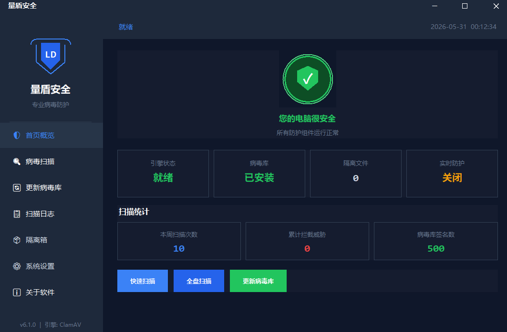
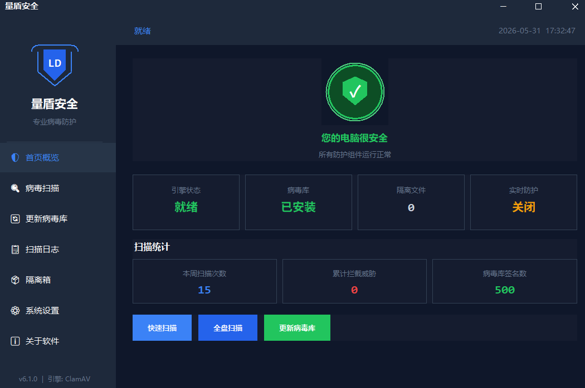
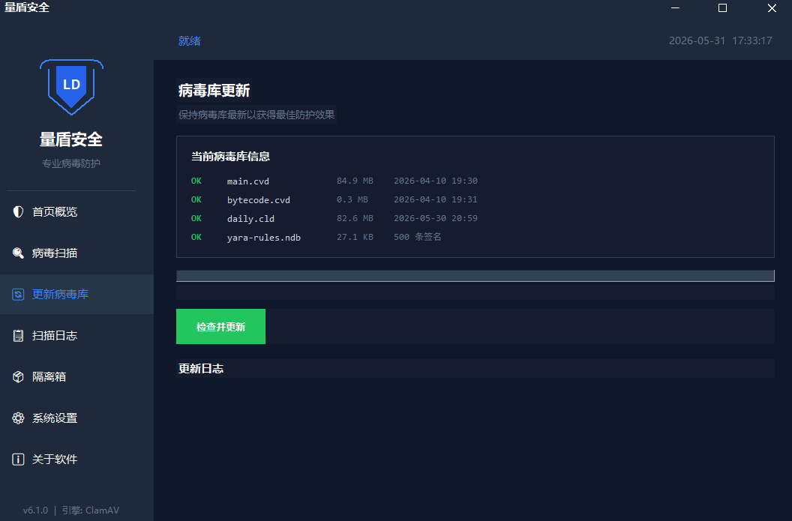
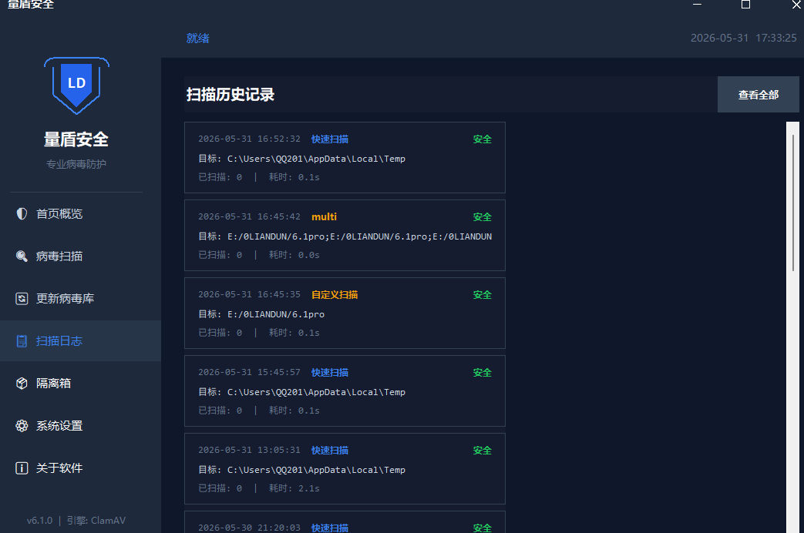
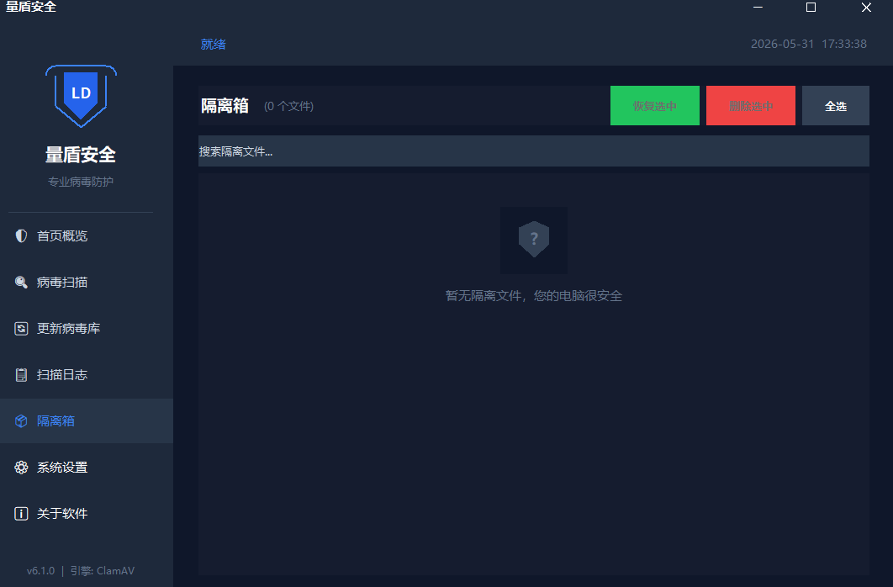
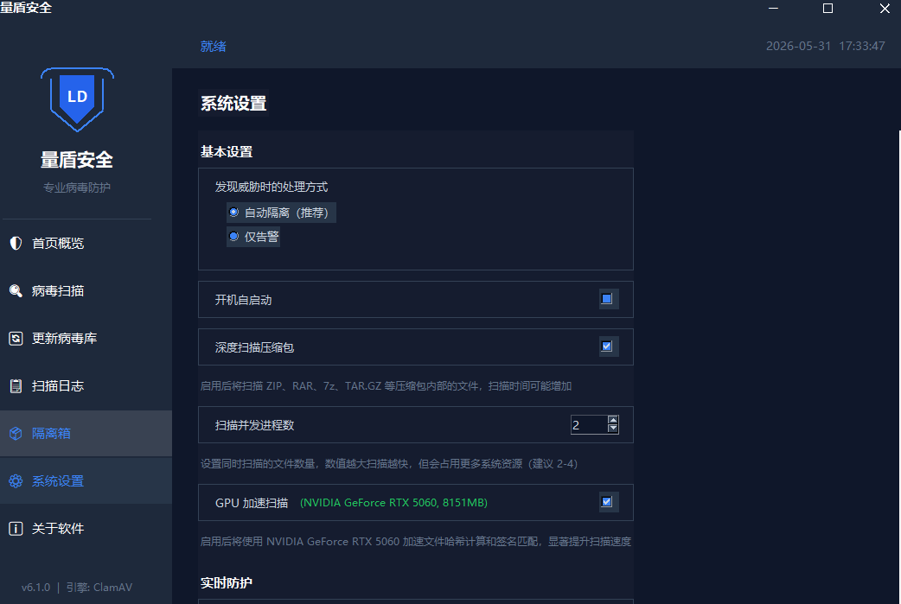

<p align="center">
  
  
  
  
  
</p>

---

## 简介

**量盾（LiangDun）** 是一款轻量级 Windows 系统安全工具，集系统监控、进程管理、病毒扫描、实时防护、网络监控、文件清理等功能于一体。界面简洁现代，资源占用低，支持后台托盘运行。

> 官网：[liangdun.top](https://liangdun.top)　社区：[www.liangdun.top](https://www.liangdun.top)

---

## ⚠️ 重要：仓库目录 ≠ 程序运行目录

本仓库为了**源码管理与归档清晰**，把文件按类型归入了 `src/`、`data/`、`releases/`、`docs/` 四个目录。

**这套分类只是仓库的归档方式，并不是程序实际运行时的目录结构。**

程序在运行时要求 `clamav/` 引擎目录与主程序 `.py` 文件位于**同一级目录**，这是代码里的硬约定：

```python
BASE_DIR   = get_base_dir()          # 开发环境下 = Path(__file__).parent
CLAMAV_DIR = BASE_DIR / "clamav"     # 即"脚本所在目录/clamav"
```

也就是说，仓库中的 `src/current/6.1.py` 只是**源码存放位置**。真正部署运行时，请按下节《真实运行目录》摆放文件。

---

## 真实运行目录

把 `src/current/6.1.py` 取出，放到一个独立目录中，并在同级放置 ClamAV 引擎：

```text
量盾/                          ← 程序目录（位置任意，如 D:\LiangDun）
├── 6.1.py                     ← 主程序（取自 src/current/6.1.py）
└── clamav/                    ← ClamAV 引擎目录（需自行下载，本仓库不含）
    ├── clamscan.exe           ← 扫描程序
    ├── freshclam.exe          ← 病毒库更新程序
    ├── clamd.exe              ← 守护进程（可选）
    ├── scan.bat               ← 扫描脚本
    ├── update.bat             ← 更新脚本
    └── db/                    ← 病毒库
        ├── main.cvd
        ├── daily.cld
        ├── bytecode.cvd
        └── yara-rules.ndb     ← YARA 转换签名（可选）
```

**运行时数据不写在这里。** 首次启动后，日志、隔离区、配置与病毒库会自动创建在用户可写目录：

```text
%LOCALAPPDATA%\LiangDunSecurity\
├── db\                        ← 病毒库（从 clamav\db 迁移）
├── logs\                      ← 运行日志
├── conf\                      ← clamd.conf / freshclam.conf
├── quarantine\                ← 隔离区
├── settings.json              ← 设置记忆
└── yara_rules.json            ← YARA 规则编辑器保存的规则
```

> 这样设计是为了避免安装到 `Program Files` 等只读系统目录时出现权限问题。

---

## 仓库目录结构

```text
LDEFENDER/
├── README.md                        # 本文件
├── LICENSE                          # MIT 许可证
├── CHANGELOG.md                     # 更新日志与整理记录
├── .gitignore
├── requirements.txt                 # 当前版依赖
│
├── src/                             # 源码
│   ├── current/
│   │   ├── 6.1.py                   # ★ 当前版本主程序
│   │   └── clamav/README.md         # ClamAV 引擎放置说明
│   └── legacy/                      # 历史版本源码
│       ├── v1.py                    # 基础版（5 模块）
│       ├── v4.py                    # 完整版（9 模块）
│       ├── v4_plus.py               # 增强版（+隔离沙盒）
│       ├── 5.4-liangdun.py          # ClamAV 引擎集成版（内部版本 v5.2.4）
│       ├── 5.5.py
│       ├── 6.0.py
│       └── requirements.txt         # 历史版本依赖（CustomTkinter 时代）
│
├── data/                            # 特征库与规则数据
│   ├── md5-signatures/              # 旧版 MD5 特征库分片（11 片）
│   │   └── 00001.md5.txt … 00011.md5.txt
│   └── yara/
│       └── webshells_index.zip      # YARA 规则集（WebShell + APT，459 条）
│
├── releases/                        # 历史版本打包
│   ├── liangdunv2.zip               # v2 打包成品（PyInstaller onedir）
│   ├── 5.0-open.zip                 # 5.0 开源版
│   └── 5.2-plus.zip                 # 5.2 增强版
│
└── docs/
    ├── images/                      # 界面截图
    │   └── screenshot-01.png … screenshot-08.png
    ├── intro-article.md             # 项目介绍文章
    └── clamav-yara.md               # ClamAV + YARA 规则集成说明
```

---

## 功能特性

| 模块 | 说明 |
|------|------|
| **系统监控** | 实时展示 CPU、内存、磁盘使用率，含进度条与详细指标 |
| **进程管理** | 查看所有运行进程，支持按 PID 结束进程 |
| **病毒扫描** | ClamAV 引擎本地扫描 + MD5/YARA 签名检测，支持单文件/文件夹/多文件 |
| **实时防护** | 后台持续监控新进程与文件变化（watchdog），发现威胁弹窗告警并支持一键终止 |
| **网络监控** | 实时展示 TCP/UDP 连接列表，支持搜索过滤与结束连接对应进程 |
| **快速查杀** | 一键扫描临时目录、下载、桌面、AppData 等高危区域 |
| **全盘查杀** | 全盘深度扫描，带进度条、实时路径显示、结果导出 |
| **隔离沙盒** | 将可疑文件移入隔离区，支持清单记录与加密导出 |
| **YARA 规则编辑** | 内置 YARA 规则编辑器，可自定义规则并即时生效（6.1） |
| **文件清理** | 清理系统临时文件、浏览器缓存、回收站 |
| **启动项管理** | 查看用户/系统启动项，支持设置或取消量盾开机自启 |
| **定时扫描** | 支持计划任务式定时查杀 |
| **设置记忆** | 白名单、清理选项、防护开关等配置持久化保存 |
| **多语言** | 中文 / English 界面切换（6.1） |
| **系统托盘** | 关闭窗口后最小化到托盘，后台静默运行 |

---

## 界面预览

| 主界面 | 扫描 | 防护 |
|:---:|:---:|:---:|
|  |  |  |

| 隔离区 | 网络监控 | 设置 |
|:---:|:---:|:---:|
|  |  |  |

> 其余截图见 [`docs/images/`](docs/images/)。

---

## 快速开始

### 环境要求

- Windows 10 / 11
- Python 3.8+

### 1. 安装 Python 依赖

```bash
# 当前版本（6.1）
pip install -r requirements.txt

# 历史版本（v1 / v4 / v4_plus，CustomTkinter 时代）
pip install -r src/legacy/requirements.txt
```

### 2. 准备 ClamAV 引擎

从 ClamAV 官方网站下载 Windows x64 版（推荐 **1.5.2**），解压后把整个 `clamav` 目录放到主程序同级：

- 下载地址：<https://www.clamav.net/downloads>
- 首次使用前运行 `clamav\update.bat` 或 `freshclam.exe` 更新病毒库

> 仓库不包含 ClamAV 二进制文件：一是体积过大，二是 ClamAV 以 GPL v2 授权，请从官方渠道获取。

### 3. 运行

```bash
cd 量盾
python 6.1.py
```

### 4. 打包为 EXE

```bash
pip install pyinstaller
pyinstaller --onefile --windowed --name "量盾" --icon=app.ico 6.1.py
```

---

## 版本谱系

> 注意：文件名中的编号是作者的**修订序号**，与代码内部 `APP_VERSION` 不一定一致。

| 仓库文件 | 内部版本 | 主要变化 |
|----------|----------|----------|
| `src/legacy/v1.py` | — | 基础版：系统监控、进程管理、病毒扫描、文件清理、启动项 |
| `src/legacy/v4.py` | — | 完整版：+ 实时防护、网络监控、快速查杀、全盘查杀、设置记忆、系统托盘 |
| `src/legacy/v4_plus.py` | — | 增强版：+ 隔离沙盒、多文件选择、扫描逻辑优化 |
| `src/legacy/5.4-liangdun.py` | v5.2.4 | 引入 ClamAV 引擎，界面从 CustomTkinter 迁移到原生 tkinter |
| `src/legacy/5.5.py` | — | ClamAV 自动配置、自动检测、自动更新病毒库 |
| `src/legacy/6.0.py` | v6.0.0 | + watchdog 实时文件监控、MD5/YARA 签名库、GPU 加速检测 |
| `src/current/6.1.py` | v6.0.0 | ★ 当前版：+ 中英文双语、YARA 规则编辑器、定时扫描、扫描历史（SQLite） |

**技术代际分界：** `v1`/`v4`/`v4_plus` 使用 **CustomTkinter**（依赖 `customtkinter`、`pystray`、`Pillow`、`requests`）；从 `5.4` 起改为 **原生 tkinter + ClamAV 引擎**，依赖大幅减少。

---

## 技术架构

```text
┌──────────────────────────────────────────┐
│            tkinter / CustomTkinter GUI    │
│  ┌────────┬────────┬────────┬──────────┐ │
│  │ 监控页  │ 进程页  │ 扫描页  │ 清理页   │ │
│  ├────────┼────────┼────────┼──────────┤ │
│  │ 启动项  │ 防护页  │ 网络页  │ 快速查杀 │ │
│  ├────────┼────────┼────────┼──────────┤ │
│  │ 全盘查杀│ 隔离区  │ YARA   │ 关于页   │ │
│  └────────┴────────┴────────┴──────────┘ │
├──────────────────────────────────────────┤
│              业务逻辑层                    │
│  ┌─────────────────────────────────────┐ │
│  │ psutil (系统信息)  │ hashlib/hmac     │ │
│  │ watchdog (文件监控)│ sqlite3 (历史)   │ │
│  │ subprocess (ClamAV)│ winreg (注册表)  │ │
│  │ threading (并发)   │ ctypes (WinAPI)  │ │
│  └─────────────────────────────────────┘ │
├──────────────────────────────────────────┤
│              数据持久层                    │
│  ┌─────────────────────────────────────┐ │
│  │ %LOCALAPPDATA%\LiangDunSecurity\     │ │
│  │   settings.json / logs/ / quarantine/│ │
│  │   db/ (main.cvd, daily.cld, *.ndb)   │ │
│  └─────────────────────────────────────┘ │
└──────────────────────────────────────────┘
```

---

## 病毒库与检测规则

量盾的检测能力由三部分组成：

| 来源 | 位置 | 说明 |
|------|------|------|
| **ClamAV 官方病毒库** | `%LOCALAPPDATA%\LiangDunSecurity\db\` | `main.cvd` + `daily.cld` + `bytecode.cvd`，约 90,000+ 签名，由 `freshclam` 更新 |
| **YARA 转换签名** | 同上，`yara-rules.ndb` | 由 YARA 规则转换而来，见 [`docs/clamav-yara.md`](docs/clamav-yara.md) |
| **自定义 MD5 签名** | 同上，`custom-md5.hsb` | 支持大小通配符的 MD5 哈希签名 |

此外，`data/` 目录下另存有两份**历史数据**，当前版本已不再读取，仅作归档：

- `data/md5-signatures/00001–00011.md5.txt` — 早期版本的 MD5 特征库分片，内容为 **VirusShare** 恶意样本哈希列表（每片约 10 万条）
- `data/yara/webshells_index.zip` — YARA 规则集，含 WebShell 与 APT 相关签名共 459 条

---

## 安全说明

- 量盾是一款**辅助安全工具**，不能替代专业杀毒软件
- 实时防护依赖本地 ClamAV 引擎与病毒库，病毒库过期会显著降低检出率
- 结束系统关键进程可能导致系统不稳定，请谨慎操作
- 隔离沙盒仅做文件移动，不提供加密或沙箱执行环境
- 导出的样本 ZIP 默认使用固定口令 `infected`（行业惯例），请勿随意分发
- 结果中的系统关键进程可能对判定结果造成误导，请留意甄别

---

## 更新日志

完整的版本历史与本次仓库整理记录见 [`CHANGELOG.md`](CHANGELOG.md)。

### 2026-04-05
- 修复部分进程误报
- 优化启动速度，降低资源占用
- 界面细节优化

### 2026-04-01
- 新增文件清理功能
- 修复闪退问题

### 2026-03-28
- 首个版本发布，基础进程监控 + 文件扫描

---

## 许可证

本项目采用 **MIT License**，详见 [`LICENSE`](LICENSE)。

> **第三方组件说明：** 本项目调用 [ClamAV](https://www.clamav.net) 反病毒引擎（以独立可执行文件方式调用，未修改其源码）。ClamAV 版权归 © Cisco Systems, Inc. 所有，以 **GNU General Public License v2.0** 授权。相关源代码可从 <https://www.clamav.net> 获取。

---

<p align="center">
  <sub>Made with ❤️ by LiangDun Team</sub>
</p>
